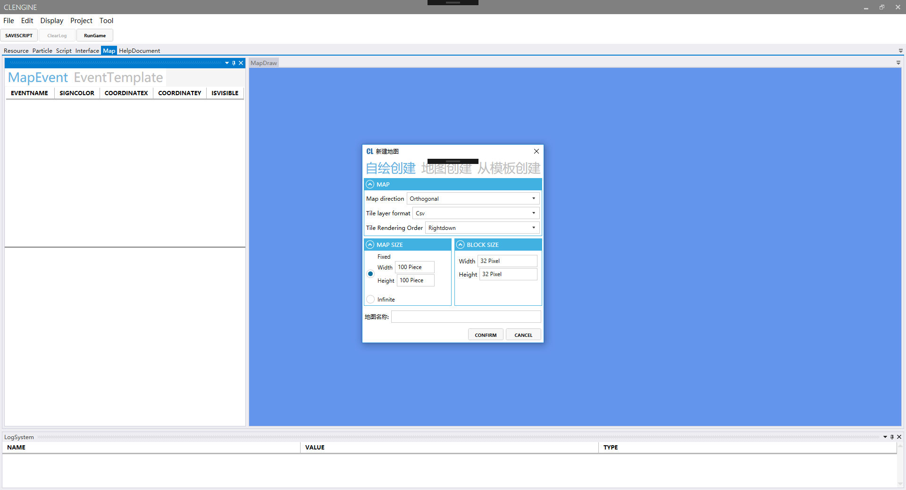
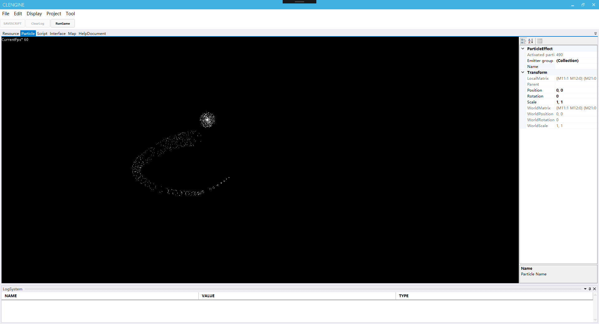
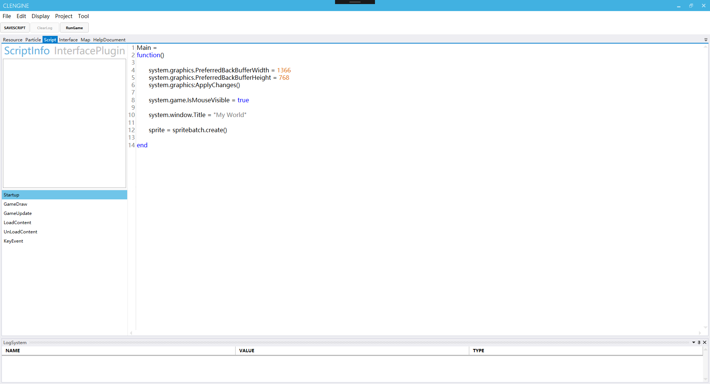
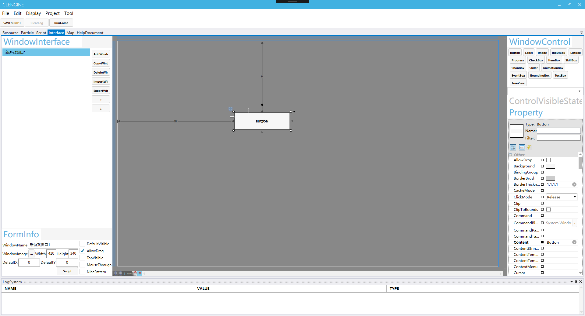
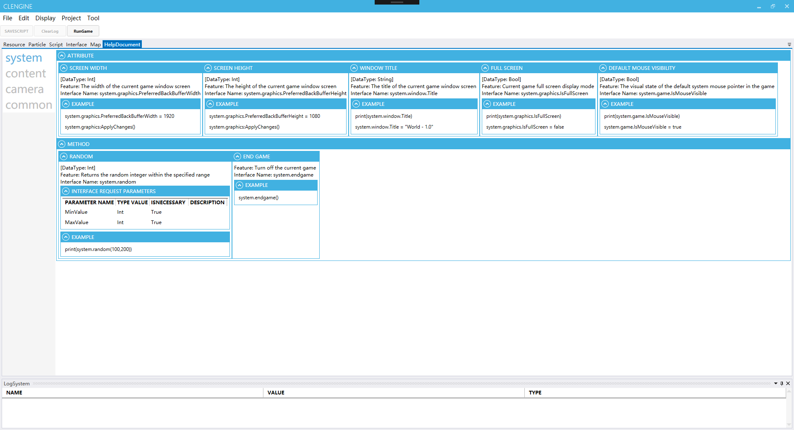
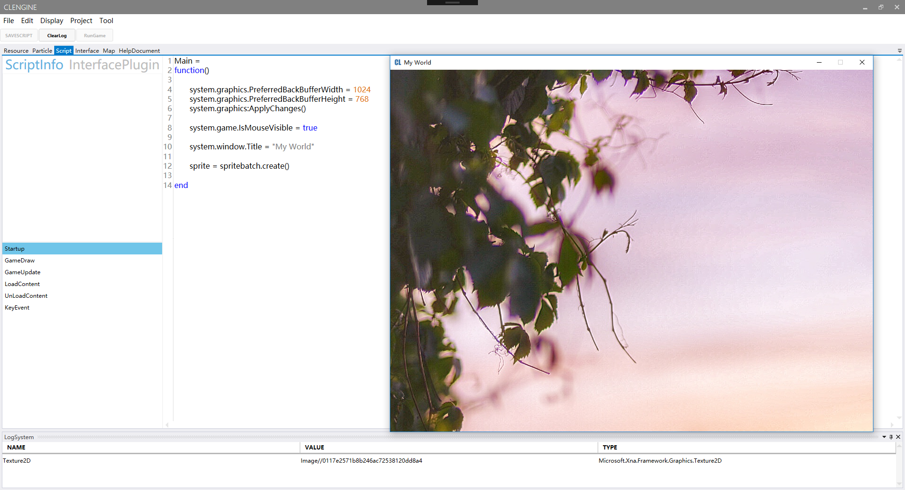

# CLEngine

> I think we need your help to improve our editor. I will build a platform to integrate all tools based on monogame. Please join us! 

> 我想我们需要你的帮助来完善我们的编辑器，我将打造一个基于monogame将所有工具为一体化的平台，请加入我们！

## FEATURE
* UIEDITOR
* MAPEDITOR
* PARTICLEEDITOR
* SCRIPTEDITOR
* HELPDOCUMENT

## THANKS HELP

* [MonoGame](https://github.com/MonoGame/MonoGame)
* [MonoGame.Extended](https://github.com/craftworkgames/MonoGame.Extended)
* [Avalonedit](https://github.com/icsharpcode/AvalonEdit)
* [FSMsharp](https://github.com/xanathar/FSMsharp)
* [WpfInterop](https://gitlab.com/MarcStan/MonoGame.Framework.WpfInterop)